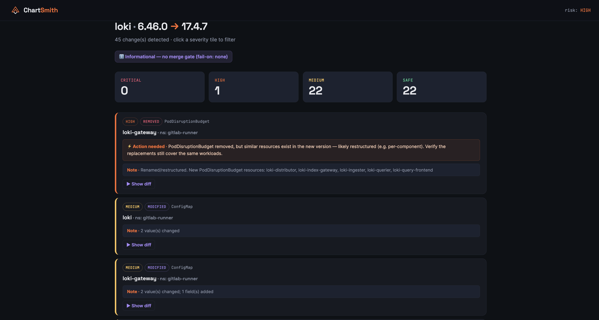
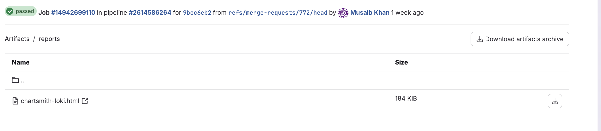

<p align="center">
  
</p>

<h3 align="center">Forecast every breaking change <em>before</em> you upgrade a Helm chart.</h3>

<p align="center">
  
  
  
  
</p>

---

## About

**ChartSmith** is a CI-native Helm upgrade advisor. Point it at a chart version bump in a
merge/pull request and it renders both versions with **your** `values.yaml`, diffs the
resulting Kubernetes manifests, and returns a **severity-ranked, actionable report** — so you
know what will break *before* the upgrade hits your cluster.

It's built for GitOps shops (ArgoCD / Flux / Renovate) where chart bumps land as automated PRs
and merge blind today. ChartSmith runs as a single CLI inside your pipeline, auto-detects
**GitLab or GitHub**, and posts the report straight onto the MR/PR.

> Born from LGTM-stack upgrade pain (Loki 6.x → 17.x is brutal), works on any Helm chart.

---

## Screenshots

> The full report renders as a self-contained HTML page, published as a CI artifact and linked
> from the MR/PR comment.




*(Drop your own PNGs at `docs/screenshot-report.png` and `docs/screenshot-artifacts.png`.)*

---

## Features

- 🔍 **Manifest-level diff** — pulls both chart versions, renders with your values, diffs the rendered Kubernetes objects (not just the chart files).
- 🎯 **K8s-aware severity** — `critical / high / medium / safe`, classified by *what actually breaks* (immutable fields, removals, deprecated APIs) — not noise.
- ⚡ **Action hints** — every high-risk change carries a one-line remediation (e.g. `kubectl delete sts <name> --cascade=orphan`).
- 🧬 **CRD change detection** — flags the silent Helm footgun: CRDs are installed once and **never upgraded** by `helm upgrade`/ArgoCD. CRD schema/version changes surface as **critical** with the manual `kubectl apply` fix.
- 🎨 **Styled HTML report** — dark-themed, filterable by severity, collapsible per-resource diffs. Opens in a new tab.
- 🔌 **GitLab & GitHub** — one binary, auto-detects the platform and posts to the MR/PR.
- 🧩 **Umbrella / ArgoCD aware** — auto-detects and unwraps dependency-wrapped values (`loki:` wrappers, ArgoCD `Application`, helmfile).
- 🚦 **Merge gate** — `--fail-on` exits non-zero on a chosen severity, so CI can block risky merges.

---

## How it works

```
 MR/PR bumps a chart version
            │
            ▼
   chartsmith ci  (in CI)
            │
   ┌────────┴─────────┐
   │ 1. detect-bump   │  Chart.yaml deps · ArgoCD Application · helmfile
   │ 2. helm pull ×2  │  old + new version
   │ 3. helm template │  rendered with YOUR values (wrapper auto-unwrapped)
   │ 4. diff + assess │  K8s-aware severity + action hints
   │ 5. render HTML   │  + post MR/PR comment
   └──────────────────┘
            │
            ▼
   HTML artifact  +  MR/PR comment  +  exit code (gate)
```

---

## Requirements

| | |
|---|---|
| Helm | **3.16+** (for `--skip-schema-validation`) |
| Python | 3.11 (bundled in the image) |
| Git | needed for `detect-bump` (full clone: `GIT_DEPTH: 0`) |
| Runtime | a container runner; image ships helm + git + the CLI |

---

## Install

Build and push the CI image (multi-arch note below):

```bash
# Build for the CI runner's arch (GitLab/GitHub runners are linux/amd64)
podman build --platform linux/amd64 -f Dockerfile.ci -t ghcr.io/<you>/chartsmith-cli:latest .
podman push ghcr.io/<you>/chartsmith-cli:latest
```

> **Apple Silicon note:** build with `--platform linux/amd64`. Don't run helm during the build —
> Go binaries crash under QEMU emulation. The image only runs natively on amd64 runners.

---

## GitLab integration

```yaml
# .gitlab-ci.yml
stages: [chartsmith]

chartsmith-analyze:
  image: ghcr.io/<you>/chartsmith-cli:latest
  stage: chartsmith
  rules:
    - if: $CI_PIPELINE_SOURCE == 'merge_request_event'
  variables:
    GIT_DEPTH: "0"                  # full clone so detect-bump sees the base ref
    HELM_CACHE_DIR: "/tmp/helm-cache"
  script:
    - chartsmith ci --fail-on none --output-dir reports
  artifacts:
    when: always
    paths: [reports/]
    expose_as: "ChartSmith reports"
    expire_in: 14 days
  allow_failure: true
```

- Posts a `## ChartSmith` MR comment with a direct link to each report (opens with no interstitial).
- For the comment, set a CI variable **`GITLAB_API_TOKEN`** (or `GITLAB_TOKEN`) with `api` scope.
  Without it, links still print to the job log and the `expose_as` artifact widget.

## GitHub integration

```yaml
# .github/workflows/chartsmith.yml
on: { pull_request: {} }
jobs:
  chartsmith:
    runs-on: ubuntu-latest
    steps:
      - uses: actions/checkout@v4
        with: { fetch-depth: 0 }
      - run: |
          docker run --rm -v "$PWD:/repo" -w /repo \
            -e GITHUB_ACTIONS -e GITHUB_REPOSITORY -e GITHUB_REF \
            -e GITHUB_SHA -e GITHUB_BASE_REF -e GITHUB_TOKEN \
            ghcr.io/<you>/chartsmith-cli:latest ci --fail-on none
```

On GitHub the full markdown report is posted **inline** in the PR comment (GitHub renders
`<details>` + diff blocks natively).

---

## CLI reference

### `chartsmith ci`
One-shot CI driver. Auto-detects GitLab/GitHub, derives the base/head refs, analyses every
chart bump in the MR/PR, writes HTML reports, and posts a comment.

| Flag | Default | Description |
|------|---------|-------------|
| `--output-dir` | `reports` | Where to write HTML reports (publish as artifacts) |
| `--values-file` | `values.yaml` | Values filename next to each changed `Chart.yaml` |
| `--fail-on` | `none` | `none\|critical\|high\|medium\|safe` — exit 1 at/above this severity |
| `--path` | `.` | Directory to scan for bumps |
| `--base-ref` / `--head-ref` | from CI env | Override the git refs |
| `--no-comment` | off | Generate reports without posting a comment |

### `chartsmith analyze`
Analyse a single explicit upgrade.

```bash
chartsmith analyze \
  --chart loki --from-version 6.46.0 --to-version 17.4.7 \
  --repo-url https://grafana-community.github.io/helm-charts \
  --values loki/values.yaml \
  --fail-on critical --format html > report.html
```
Formats: `markdown` (default), `html`, `json`, `text`. Auto-detects the values wrapper key.

### `chartsmith detect-bump`
Just list the version bumps in a git diff.

```bash
chartsmith detect-bump --base-ref <sha> --head-ref HEAD --format json
```

---

## Severity model

| Severity | Means | Examples |
|----------|-------|----------|
| 🔴 **critical** | Will break / data loss / manual step required | immutable field changed (`volumeClaimTemplates`, `serviceName`), StatefulSet/PVC removed, **CRD schema change**, deprecated API |
| 🟠 **high** | Needs a human's eyes before merge | workload/Service/PDB removed-but-replaced, Service type change, replica change |
| 🟡 **medium** | Rolling-update churn | image bumps, env/serviceAccount changes, port changes |
| 🟢 **safe** | Cosmetic | labels, annotations, securityContext, chart-version |

The **risk** label (corner of the report) reflects inherent severity. The **verdict** badge reflects
the *gate* (`--fail-on`): `Informational` when off, `Pass`/`Blocked` when set. They're independent —
a high-risk upgrade still shows "Informational" if you haven't enabled the gate.

---

## Where reports go

1. **HTML artifact** — `reports/chartsmith-<chart>.html`, published via `artifacts:`.
2. **MR/PR comment** — links (GitLab) or full markdown (GitHub).
3. **Job log** — direct report URLs always printed, even if commenting fails.
4. **GitLab pages-artifact URL** — `https://<group>.gitlab.io/-/<path>/-/jobs/<id>/artifacts/reports/<file>` (opens directly).

---

## Troubleshooting

| Symptom | Cause / fix |
|---------|-------------|
| `comment posting failed (HTTP 401)` | `GITLAB_TOKEN` missing/unscoped. Use **`GITLAB_API_TOKEN`** with `api` scope; check it isn't a *Protected* variable on an unprotected MR branch. Links still appear in the log + artifact widget. |
| `Please define <x>` render error | Your values are incomplete for that version, **or** a dependency-wrapped values file wasn't unwrapped. ChartSmith auto-detects the wrapper; pass `--wrapper-key` to force it. |
| `values don't meet the schema` | Handled automatically — ChartSmith retries with `--skip-schema-validation`. |
| `lfstack.push` / `fatal error` on `podman build` | QEMU can't run the amd64 helm Go binary during build. The Dockerfile avoids executing helm at build time; build with `--platform linux/amd64` and it pushes/runs fine on amd64 runners. |
| Report shows fewer resources than ArgoCD | ChartSmith renders the subchart standalone; a parent-umbrella render mode (full ArgoCD parity) is the planned next step. |
| Counts differ from a previous run | Severity is computed from **your** `values.yaml` — different values render different manifests. |

---

## Versioning

Image tags are bumped per change (`v-0.13`, …). Pin a tag in CI rather than `latest` so runners
don't serve a cached image — or set `pull_policy: always`.

---

## License

[Apache License 2.0](LICENSE) — Copyright © Musaib Khan.
